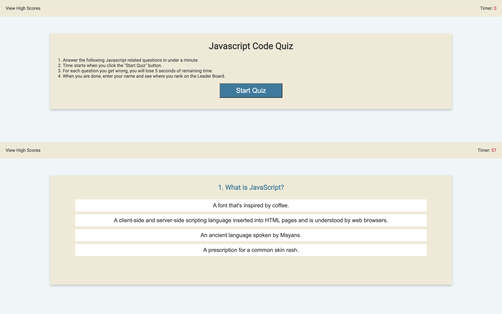
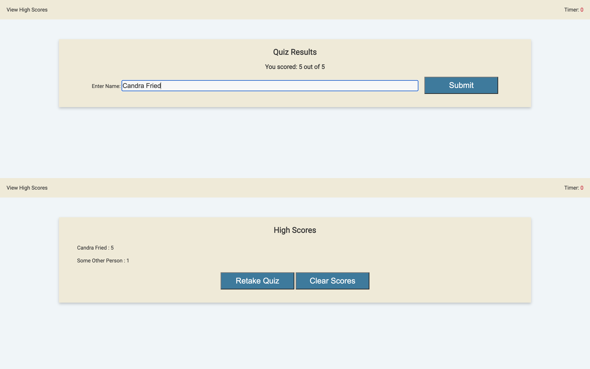

# Code Quiz
A timed quiz on JavaScript fundamentals that stores high scores.

## Important URLs

* [Deployed Application URL](https://candracodes.github.io/code-quiz/) 
* [GitHub Repo URL](https://github.com/candracodes/code-quiz)

## Foreword

* This application aims to accomplish the following:
    * Adhere to the [Assignment Guidelines](./assets/_guide/README.md) to ensure submission is in compliance with acceptance criteria
    * Investigate apt Javascript related questions in order to populate accurate questions and answers


## User Story

```
AS A coding boot camp student
I WANT to take a timed quiz on JavaScript fundamentals that stores high scores
SO THAT I can gauge my progress compared to my peers
```

## Acceptance Criteria

```
GIVEN I am taking a code quiz
WHEN I click the start button
THEN a timer starts and I am presented with a question
WHEN I answer a question
THEN I am presented with another question
WHEN I answer a question incorrectly
THEN time is subtracted from the clock
WHEN all questions are answered or the timer reaches 0
THEN the game is over
WHEN the game is over
THEN I can save my initials and my score
```

## Mock-Up

* This project should behave like this screenshot:


* Here are actual screenshots from the deployed application:




## Licensing
The project is made possible with the following Licensing:
- [MIT](license.txt)

## Contact Developer
For additional information, contact this application's developer: letschat@candracodes.com